# Cashback & Rewards Service - Low Level Design

## 1. Service Overview

### 1.1 Service Responsibilities
- **Loyalty Program Management**: Create and manage different loyalty tiers and programs
- **Cashback Calculations**: Calculate cashback based on spending patterns and rules
- **Reward Point Tracking**: Track and manage reward points accumulation
- **Redemption Management**: Handle reward redemptions and validations
- **Promotional Campaigns**: Manage special offers and bonus rewards
- **Analytics & Reporting**: Generate insights on reward utilization

### 1.2 Service Configuration
- **Port**: 3009
- **Database**: PostgreSQL
- **Runtime**: Node.js 20+
- **Framework**: Express.js
- **Authentication**: JWT Token validation
- **Caching**: Redis for frequently accessed data

## 2. Detailed Architecture Diagram

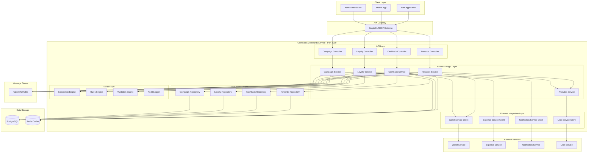

## 3. Database Design

### 3.1 Entity Relationship Diagram

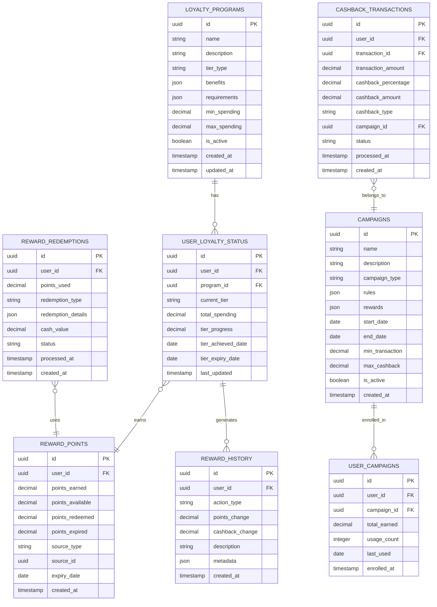

### 3.2 Table Specifications

#### 3.2.1 LOYALTY_PROGRAMS
**Purpose**: Define different loyalty tiers and their benefits
- **Primary Key**: id (UUID)
- **Indexes**: name, tier_type, is_active
- **Partitioning**: None
- **Estimated Size**: 50-100 records

#### 3.2.2 USER_LOYALTY_STATUS
**Purpose**: Track user's current loyalty status and progress
- **Primary Key**: id (UUID)
- **Foreign Keys**: user_id, program_id
- **Indexes**: user_id, program_id, current_tier
- **Partitioning**: By user_id (hash)
- **Estimated Size**: 100K+ records

#### 3.2.3 REWARD_POINTS
**Purpose**: Track user's reward points balance and transactions
- **Primary Key**: id (UUID)
- **Foreign Keys**: user_id
- **Indexes**: user_id, source_type, expiry_date
- **Partitioning**: By user_id (hash)
- **Estimated Size**: 1M+ records

#### 3.2.4 CASHBACK_TRANSACTIONS
**Purpose**: Record all cashback calculations and processing
- **Primary Key**: id (UUID)
- **Foreign Keys**: user_id, transaction_id, campaign_id
- **Indexes**: user_id, transaction_id, status, processed_at
- **Partitioning**: By created_at (monthly)
- **Estimated Size**: 10M+ records

## 4. API Design

### 4.1 RESTful API Endpoints

#### 4.1.1 Rewards Management APIs

```
GET /api/v1/rewards/{userId}
├── Purpose: Get user's reward points summary
├── Authentication: JWT Required
├── Authorization: User, Manager, Admin
├── Rate Limit: 100 requests/minute
├── Response Format: JSON
└── Cache Duration: 5 minutes

POST /api/v1/rewards/redeem
├── Purpose: Redeem reward points
├── Authentication: JWT Required
├── Authorization: User, Manager
├── Rate Limit: 10 requests/minute
├── Validation: Points balance, redemption rules
└── Response Format: JSON

GET /api/v1/rewards/{userId}/history
├── Purpose: Get reward points transaction history
├── Authentication: JWT Required
├── Authorization: User, Manager, Admin
├── Pagination: Cursor-based
├── Filters: date_range, action_type
└── Cache Duration: 10 minutes
```

#### 4.1.2 Cashback Management APIs

```
POST /api/v1/cashback/calculate
├── Purpose: Calculate cashback for a transaction
├── Authentication: JWT Required
├── Authorization: System, Service-to-Service
├── Rate Limit: 1000 requests/minute
├── Validation: Transaction amount, user eligibility
└── Response Format: JSON

GET /api/v1/cashback/{userId}/summary
├── Purpose: Get user's cashback summary
├── Authentication: JWT Required
├── Authorization: User, Manager, Admin
├── Rate Limit: 100 requests/minute
└── Cache Duration: 5 minutes

GET /api/v1/cashback/{userId}/transactions
├── Purpose: Get cashback transaction history
├── Authentication: JWT Required
├── Authorization: User, Manager, Admin
├── Pagination: Offset-based
├── Filters: date_range, status, campaign_id
└── Cache Duration: 10 minutes
```

#### 4.1.3 Loyalty Program APIs

```
GET /api/v1/loyalty/programs
├── Purpose: Get available loyalty programs
├── Authentication: JWT Optional
├── Authorization: Public
├── Rate Limit: 200 requests/minute
├── Cache Duration: 1 hour
└── Response Format: JSON

GET /api/v1/loyalty/{userId}/status
├── Purpose: Get user's loyalty status
├── Authentication: JWT Required
├── Authorization: User, Manager, Admin
├── Rate Limit: 100 requests/minute
└── Cache Duration: 5 minutes

PUT /api/v1/loyalty/{userId}/upgrade
├── Purpose: Process loyalty tier upgrade
├── Authentication: JWT Required
├── Authorization: System, Service-to-Service
├── Rate Limit: 50 requests/minute
└── Validation: Spending thresholds, eligibility
```

## 5. Business Logic Flow Diagrams

### 5.1 Cashback Calculation Flow

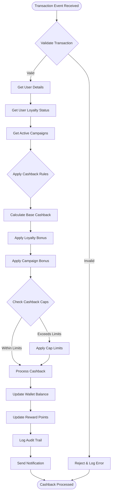

### 5.2 Reward Redemption Flow

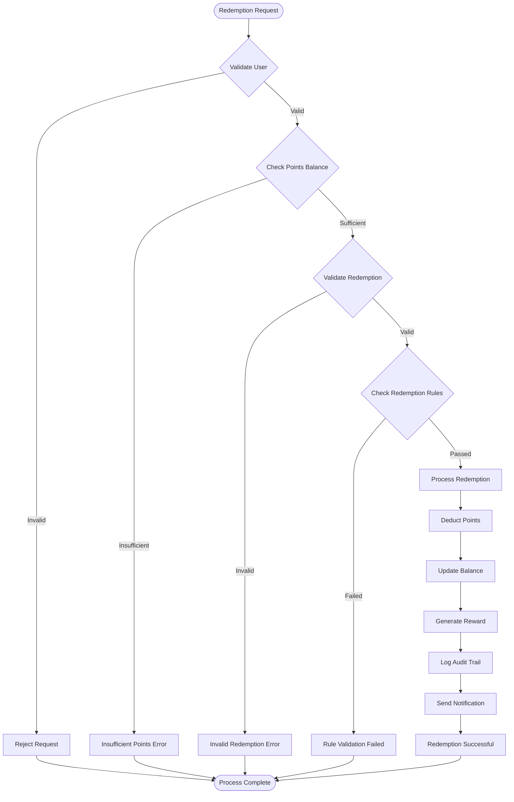

### 5.3 Loyalty Tier Upgrade Flow

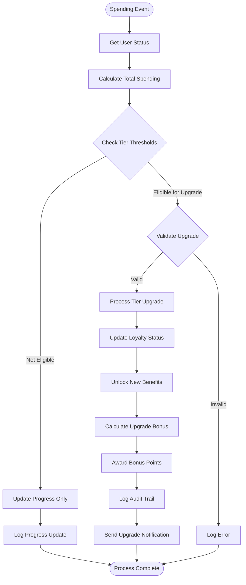

## 6. Integration Patterns

### 6.1 Event-Driven Integration

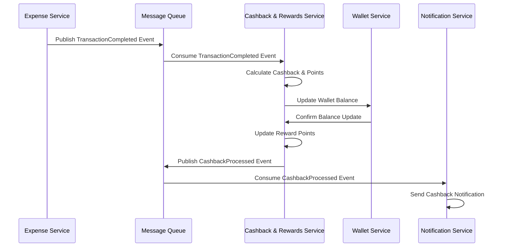

### 6.2 Synchronous API Integration

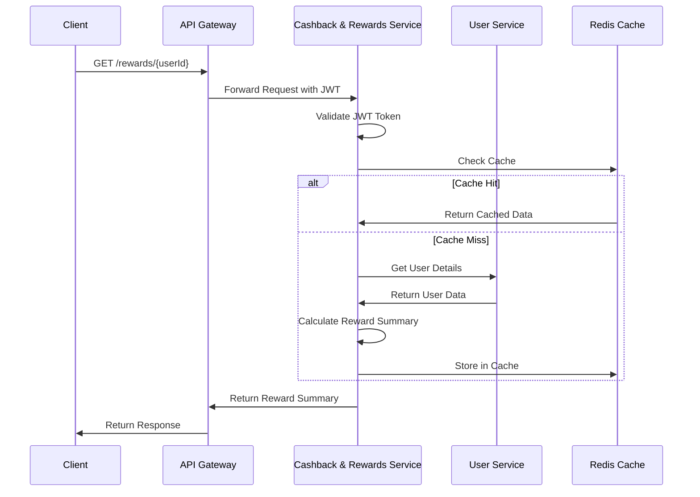

## 7. Caching Strategy

### 7.1 Cache Architecture

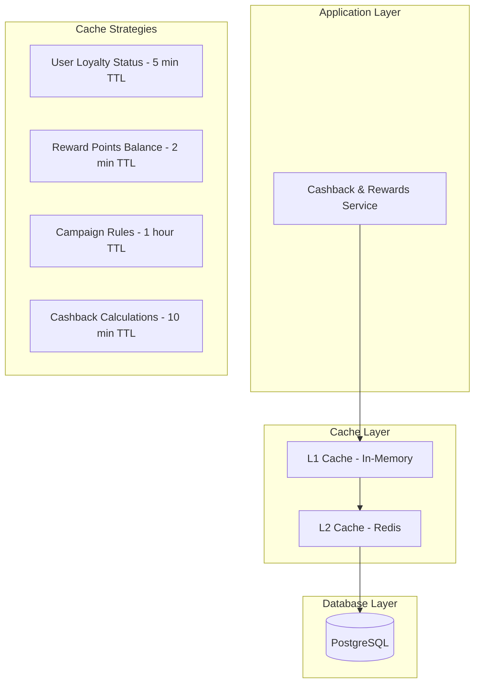

### 7.2 Cache Invalidation Patterns

#### Write-Through Pattern
- **Use Case**: Critical data like reward points balance
- **Flow**: Write to cache and database simultaneously
- **Consistency**: Strong consistency guaranteed

#### Cache-Aside Pattern
- **Use Case**: User loyalty status, campaign rules
- **Flow**: Check cache first, load from DB on miss
- **Consistency**: Eventual consistency with TTL

#### Write-Behind Pattern
- **Use Case**: Audit logs, analytics data
- **Flow**: Write to cache immediately, DB asynchronously
- **Consistency**: Better performance, eventual consistency

## 8. Error Handling & Resilience

### 8.1 Error Classification

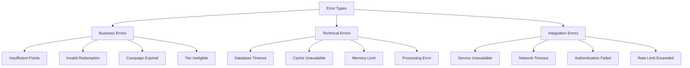

### 8.2 Retry Mechanisms

#### Exponential Backoff Strategy
```
Retry Attempt 1: Wait 1 second
Retry Attempt 2: Wait 2 seconds
Retry Attempt 3: Wait 4 seconds
Retry Attempt 4: Wait 8 seconds
Maximum Retries: 5
```

#### Circuit Breaker Pattern
```
States:
├── CLOSED: Normal operation
├── OPEN: Service unavailable, fail fast
└── HALF_OPEN: Testing if service recovered

Thresholds:
├── Failure Rate: 50% over 1 minute
├── Timeout: 30 seconds
└── Recovery Time: 60 seconds
```

## 9. Security Considerations

### 9.1 Authentication & Authorization

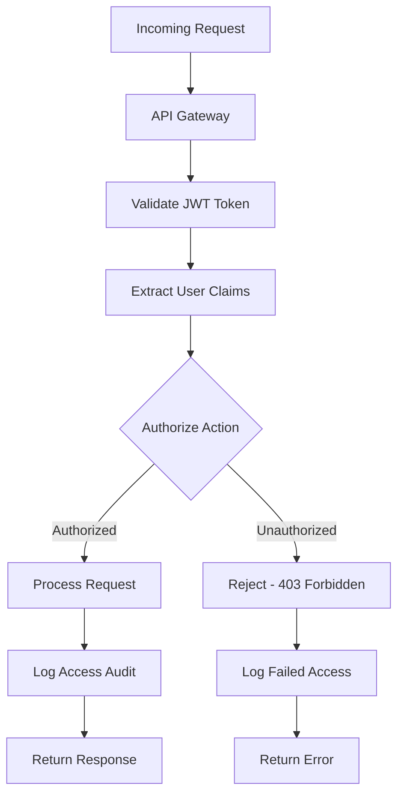

### 9.2 Data Protection

#### Sensitive Data Handling
- **PII Encryption**: User personal data encrypted at rest
- **Token Security**: JWT tokens with short expiration
- **Database Security**: Connection encryption, parameterized queries
- **API Security**: Rate limiting, input validation, CORS protection

#### Audit Trail Requirements
- **User Actions**: All redemptions and point transfers logged
- **System Events**: Cashback calculations and tier upgrades
- **Access Logs**: API access patterns and failed attempts
- **Data Changes**: Complete change history with timestamps

## 10. Performance Optimization

### 10.1 Database Optimization

#### Indexing Strategy
```sql
-- User lookup optimization
CREATE INDEX idx_user_loyalty_status_user_id ON user_loyalty_status(user_id);
CREATE INDEX idx_reward_points_user_id_expiry ON reward_points(user_id, expiry_date);

-- Query performance optimization  
CREATE INDEX idx_cashback_transactions_user_status ON cashback_transactions(user_id, status);
CREATE INDEX idx_reward_history_user_created ON reward_history(user_id, created_at DESC);

-- Campaign lookup optimization
CREATE INDEX idx_campaigns_active_dates ON campaigns(is_active, start_date, end_date);
```

#### Query Optimization Patterns
- **Batch Processing**: Process multiple transactions together
- **Pagination**: Cursor-based pagination for large datasets  
- **Aggregation**: Pre-calculate frequently accessed summaries
- **Connection Pooling**: Optimize database connections

### 10.2 Application Performance

#### Memory Management
- **Object Pooling**: Reuse calculation objects
- **Garbage Collection**: Optimize GC for low latency
- **Memory Limits**: Set appropriate heap size limits
- **Memory Monitoring**: Track memory usage patterns

#### Async Processing
- **Non-blocking I/O**: Use async/await patterns
- **Background Jobs**: Process heavy calculations asynchronously
- **Queue Management**: Handle message processing efficiently
- **Load Balancing**: Distribute requests across instances

## 11. Monitoring & Observability

### 11.1 Metrics Collection

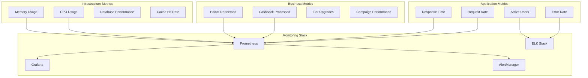

### 11.2 Health Check Implementation

#### Service Health Endpoints
```
GET /health
├── Purpose: Basic service availability
├── Response Time: < 100ms
├── Checks: Service startup, basic connectivity
└── Status Codes: 200 (healthy), 503 (unhealthy)

GET /health/detailed
├── Purpose: Comprehensive health check
├── Response Time: < 500ms
├── Checks: Database, cache, external services
└── Format: JSON with component status

GET /metrics
├── Purpose: Prometheus metrics endpoint
├── Format: Prometheus text format
├── Includes: Custom business metrics
└── Update Frequency: Real-time
```

## 12. Deployment Architecture

### 12.1 Container Configuration

```yaml
# Docker Container Specs
Resource Limits:
  CPU: 2 cores
  Memory: 4GB
  Disk: 20GB

Environment Variables:
  NODE_ENV: production
  PORT: 3009
  DB_HOST: postgresql-cluster
  REDIS_HOST: redis-cluster
  JWT_SECRET: ${JWT_SECRET}
  LOG_LEVEL: info

Health Check:
  Path: /health
  Interval: 30s
  Timeout: 10s
  Retries: 3
```

### 12.2 Scaling Strategy

#### Horizontal Scaling
- **Auto Scaling**: CPU > 70% or Memory > 80%
- **Min Replicas**: 2 instances
- **Max Replicas**: 10 instances
- **Scale Up**: Add 1 instance per trigger
- **Scale Down**: Remove 1 instance after 5 minutes

#### Load Distribution
- **Algorithm**: Round-robin with health checks
- **Session Persistence**: Not required (stateless)
- **Health Monitoring**: Continuous health checking
- **Failover**: Automatic unhealthy instance removal

This Low Level Design provides a comprehensive blueprint for implementing the Cashback & Rewards Service with detailed architecture, data models, API specifications, and operational considerations.